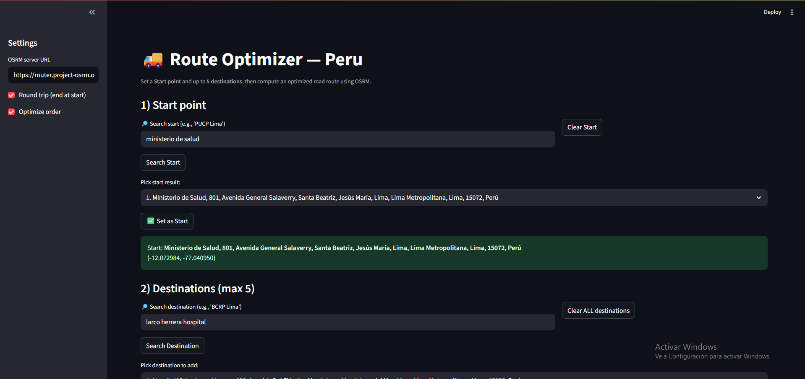
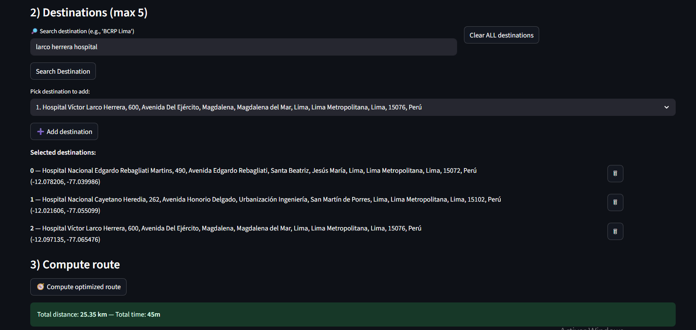
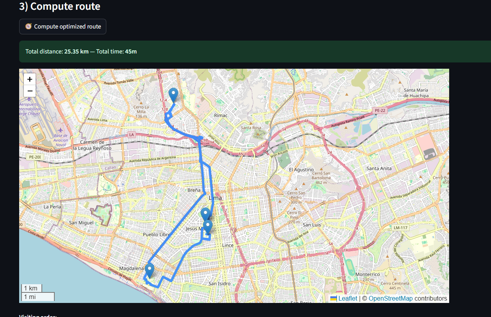
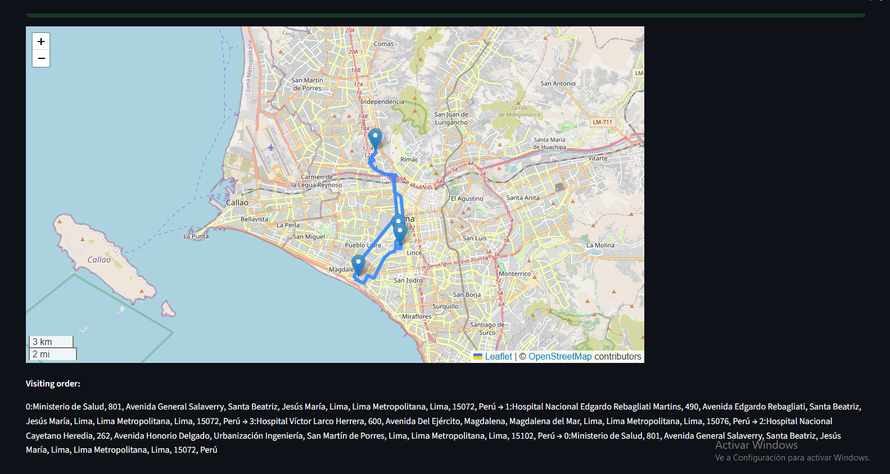

# VRP Peru – Route Optimization Engine for Medicine Delivery

## 🩺 Problem Statement
In rural and dispersed areas of Peru, such as the Apurímac region, the delivery of medicines and medical supplies faces significant logistical challenges: long distances, hard-to-access routes, and limited resources.  
This project implements a **graphical and algorithmic engine** that optimizes delivery routes, originally designed for medicine distribution in Peru but adaptable to other countries or sectors (logistics, food, parcel delivery, etc.).

Using **Python**, **OR-Tools**, and **OSRM**, it calculates optimal routes to minimize travel distance and delivery time, while **Streamlit** provides an interactive interface for non-technical users.

---

## 🚀 Features
- Route optimization with real-world constraints.
- Interactive map visualization of the optimal route.
- Distance and estimated time calculation between each point.
- Supports up to **5 destinations** per route (configurable).
- Allows selection of **starting point** and individual destination management.
- Scalable to multiple vehicles and special conditions (e.g., refrigerated cargo, weight limits, time windows).

---

## 🛠️ Requirements
- Python 3.10+
- Conda or venv recommended.
- Packages:
  - `streamlit`
  - `folium`
  - `pandas`
  - `requests`
  - `ortools`
  - `geopy`

---

## 📦 Installation
```bash
# Clone the repository
git clone https://github.com/yourusername/vrp-peru.git
cd vrp-peru

# Create a conda environment
conda create -n vrp_peru python=3.10 -y
conda activate vrp_peru

# Install dependencies
pip install -r requirements.txt

```

## How to Use

### 1️⃣ Set the Start Point
- Search for a location in the **Start point** section.  
- Click **Search Start**.  
- Select the correct result and click **Set as Start**.  



---

### 2️⃣ Add Destinations
- Search for each destination (up to 5).  
- Click **Search Destination** and then **Add destination**.  
- You can **remove individual destinations** if needed.  




---

### 3️⃣ Compute the Route
- Select whether to **Optimize order** and **Round trip** from the sidebar settings.  
- Click **Compute optimized route**.  
- The system will calculate and display:  
  - The **optimized route on the map**  
  - **Total distance & estimated time**  
  - **Visiting order list**  




---

### 4️⃣ View Results
- The interactive map allows zooming and panning.  
- Each point is clickable, showing its location.  
- The visiting order is listed below the map.  




